# midibox-seq-v4

This repository contains some documentation and data created during the build process of a MIDIBox SEQ V4. Please note that I'm **not** the original author of the project. The original project is hosted at http://ucapps.de

## MIDIbox PCBs

I ordered the PCBs from http://midiboxshop.bigcartel.com

Here is the list:

- 1x [CORE STMF32 BOARD](http://midiboxshop.bigcartel.com/product/core-stm32f4-board)
- 2x [MIDI I/O MODULE BOARD](http://midiboxshop.bigcartel.com/product/midi-i-o-module-board)
- 1x [DOUT MODULE BOARD](http://midiboxshop.bigcartel.com/product/dout-module-board)
- 1x [AOUT_NG BOARD](http://midiboxshop.bigcartel.com/product/aout_ng-module-board)
- 1x [SEQ CS BOARD](http://midiboxshop.bigcartel.com/product/seq-cs-board)

## Parts

I ordered the parts from [TME](http://www.tme.eu/en), [Reichelt](http://www.reichelt.com/), [DigiKey](http://www.digikey.com) and [Mouser](http://www.mouser.com). Sourcing the parts is a little painful. In addition, for some parts there are a few (or many) options. The following are a few notes on the parts I've chosen for the build:

- ALPS [Reichelt](https://www.reichelt.com/Drehimpulsgeber/STEC12E08/3/index.html?&ACTION=3&LA=5011&GROUP=B29&GROUPID=3714&ARTICLE=73923&OFFSET=1000&SORT=artnr)
TODO

## Custom PCB

As I wanted to have nice backpanel as well as Ethernet support, I designed a PCB with the following additional features:

- Ethernet via SPI (based on http://ucapps.de/mbhp_eth.html)
- SD card socket
- USB connector
- +/- 12V DC/DC converter for the AOUT power supply

The PCB was designed in [KiCad](http://kicad-pcb.org/) and produced by [OSH Park](https://oshpark.com/). The PCB is available [here](https://oshpark.com/shared_projects/DuxxcHS7). Feel free to order your own!

Here is the bill of materials:

| Part | Description | Supplier |
| --- | --- | --- |
| C1, C4, C5, C6, C8, C9, C10, C11, C14, C15 | Ceramic Capacitor 100 nF |
| C2, C3 | Ceramic Capacitor 18 pF |
| C7 | Tantal Capacitor 10 uF |
| C12, C16 | Polarized Capacitor 47 uF |
| C13 | Polarized Capacitor 100 uF |
| R1 | Resistor 2.32 kOhm |
| R2, R3, R4, R5 | Resistor 49.9 Ohm |
| R6, R7 | Resistor 220 Ohm |
| L1 | Ferrit Bead 10 uH | [Reichelt](https://www.reichelt.com/Filter/BEAD-10-60/3/index.html?&ACTION=3&LA=5011&GROUP=B43&GROUPID=3175&ARTICLE=105527&OFFSET=1000&SORT=artnr) |
| Y1 | Crystal 25 MHz | [Reichelt](https://www.reichelt.com/Quarze/25-0000-HC49U-S/3/index.html?&ACTION=3&LA=5011&GROUP=B41&GROUPID=3173&ARTICLE=58657&OFFSET=1000&SORT=artnr) |
| IC1 | ENC28J60-I/SP DIP | [DigiKey](http://www.digikey.ch/product-detail/de/ENC28J60-I%2FSP/ENC28J60-I%2FSP-ND/1680061) |
| P1 | USB B connector | TODO |
| U1 | 3M SD-RSMT-2-MQ | [Mouser](http://www.mouser.ch/ProductDetail/3M-Electronic-Solutions-Division/SD-RSMT-2-MQ/?qs=sGAEpiMZZMufgI%252bQGy4rlDprx2TSk7jDVrUYDCI8Alc%3d) |
| U2 | NMH0512SC ([datasheet](http://www.farnell.com/datasheets/1790401.pdf)) | [Reichelt](https://www.reichelt.com/Wandler-Module-DC-DC/NMH0512SC/3/index.html?&ACTION=3&LA=5011&GROUP=P853&GROUPID=4956&ARTICLE=140676&OFFSET=1000&SORT=artnr)
| U3 | Pulse J0026D21E | [Mouser](http://www.mouser.ch/search/ProductDetail.aspx?r=673-J0026D21E) |

## Frontpanel / Case

The frontpanel is based on the [Wilba frontpanel](http://www.midibox.org/dokuwiki/doku.php?id=wilba_mb_seq). I only adjusted some of the drillings in addition to moving things around slightly to make sure everything fits within the case. The backpanel was designed from scratch in order to fit nicely with the MIDI I/O PCBs as well as my own PCB. In addition, a DSUB-25 connector is used for the analog bus and a few important analog outputs are available seperatly on 3.5 mm jacks. The rest of the case are just basic aluminium panels and everything is hold together by enclosure profiles. The case can be ordered from [Schaeffer AG](https://www.schaeffer-ag.de). All required files are available in the ``case`` directory.

## Notes

## Links

## Build Images

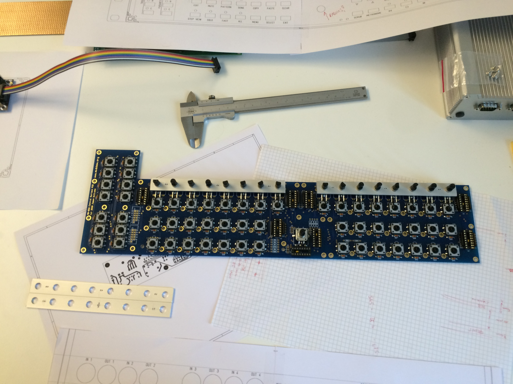
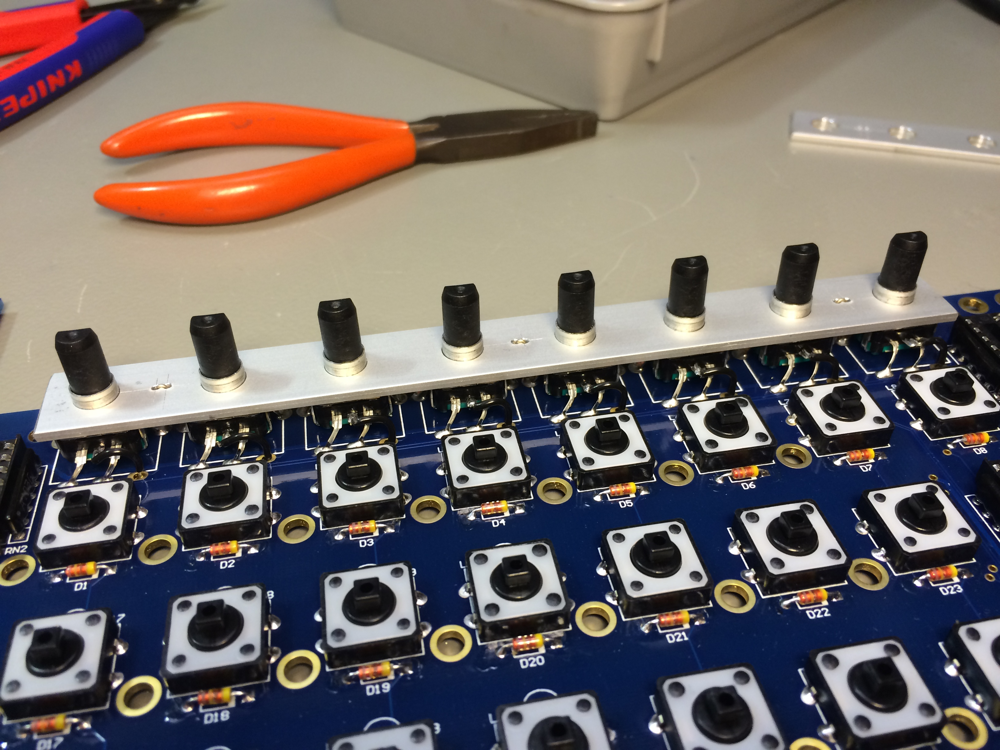
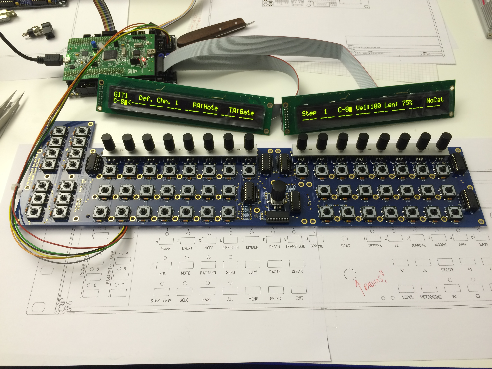
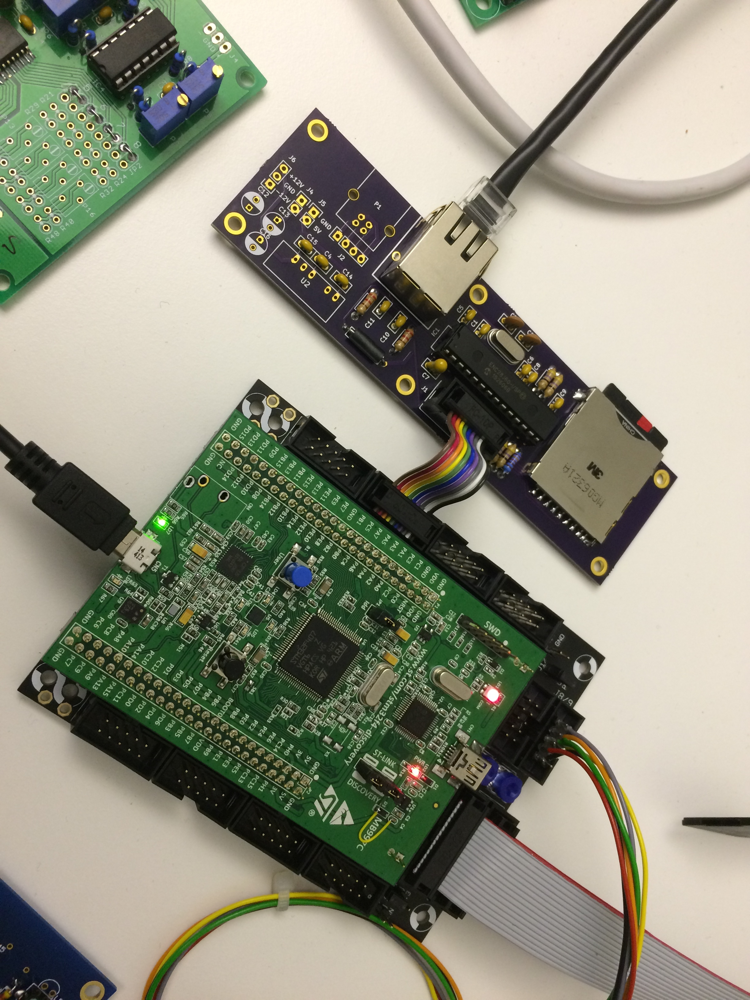
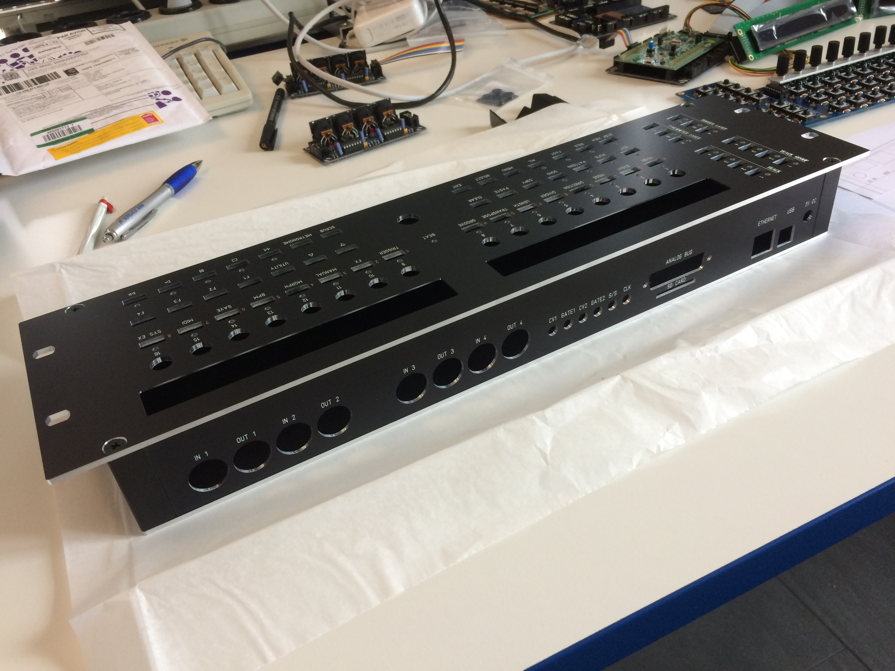
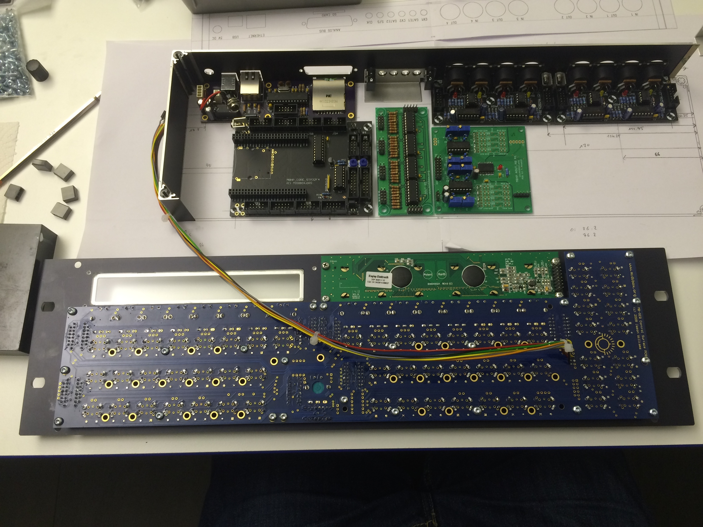
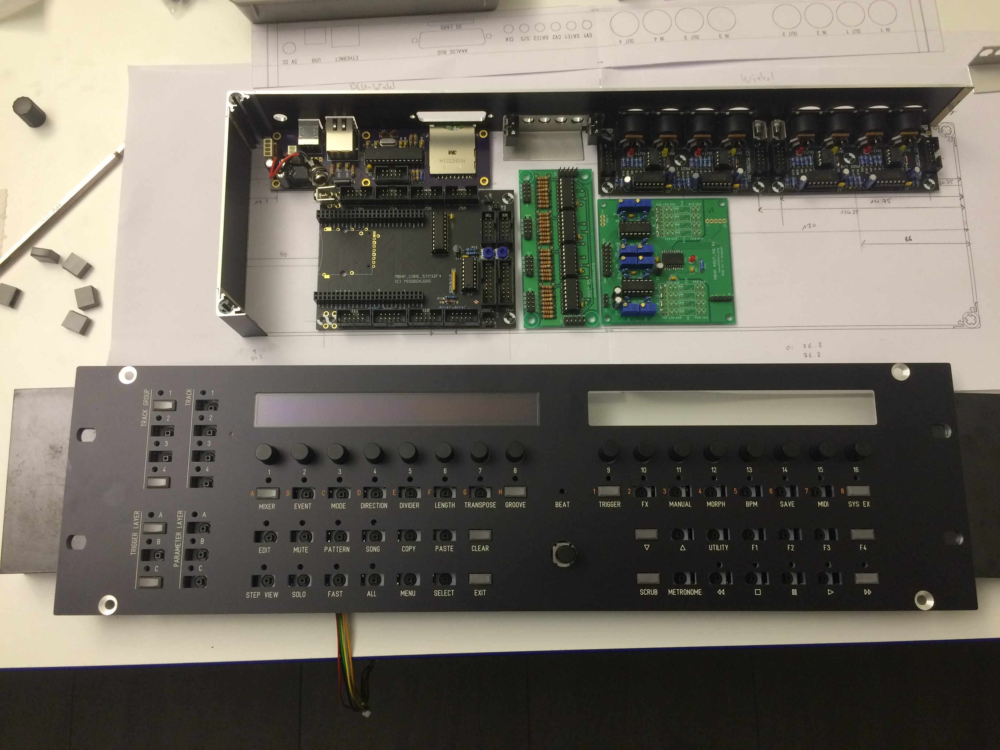

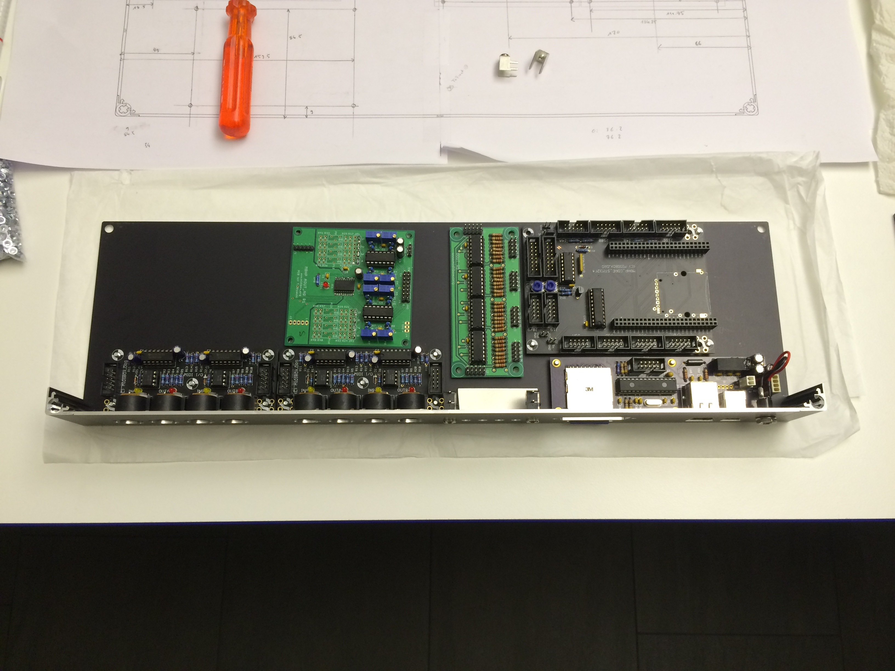
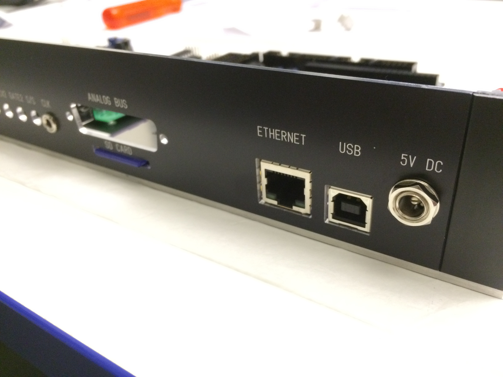
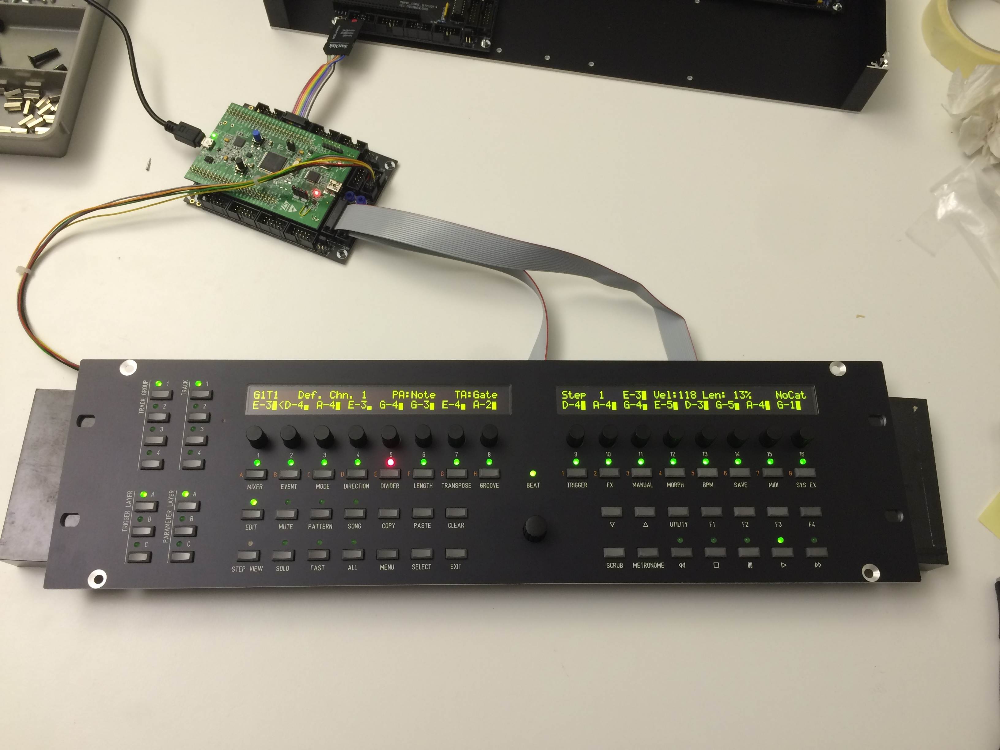
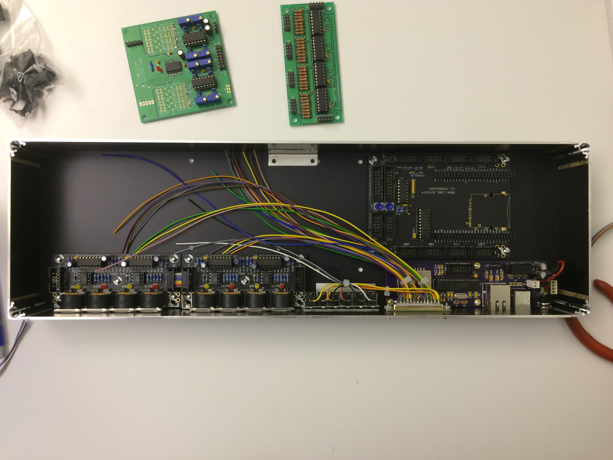

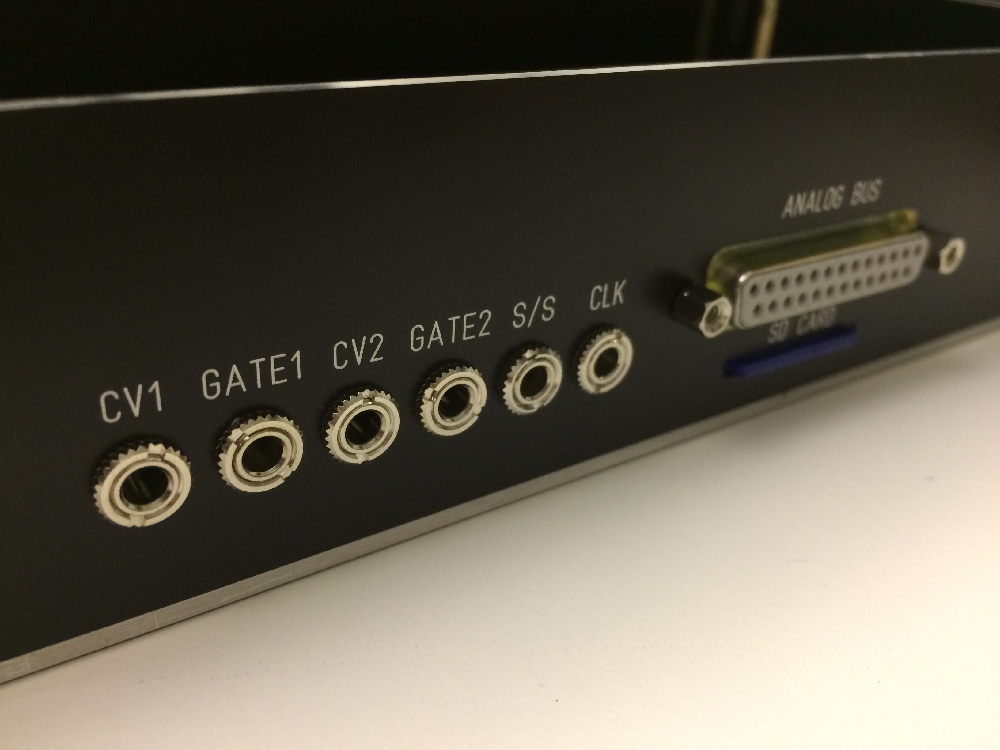

